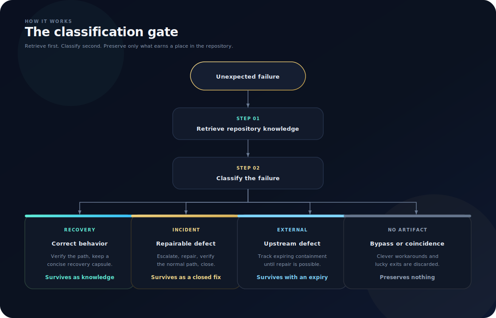
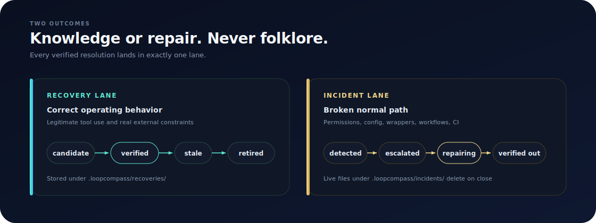
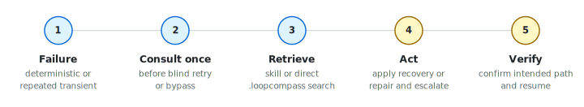

**Agents remember the right path and repair the broken one.**

A portable skill for agent workflows. No daemon, no CLI, no database, no model API, no hosted
service. Small Markdown files. Full fleet memory.


[How it works](#how-it-works) · [What it stores](#what-it-stores) · [Install](#install) · [Update](#update) · [Evaluation](#evaluation) · [Design](#design)

---

## Why it exists

Agents re-hit the same environment, tool, permission, API, CI, and workflow failures. The fix often
already happened once, in some other session, and vanished with the transcript.

**A familiar week**

1. **Monday** - An agent hits a Git permission error, burns time, finds the right path, finishes the
   task. Session ends. Nothing durable is left in the repo.
2. **Thursday** - A different agent (or you, in a new chat) hits the same error and starts from zero.
3. **Worse case** - Someone lands a clever bypass. It works. Next week every agent copies the bypass
   instead of fixing the broken wrapper.

**What LoopCompass changes**

| Situation | What happens |
| --- | --- |
| Distinctive failure shows up | Agent consults once before blind retry: skill first, or a direct search of `.loopcompass/` |
| The path is correct tool use | After verification, a short recovery file is saved automatically within repository authority |
| The normal path is broken | An incident tracks escalation and repair; the live file goes away when the normal path works again |
| It was a lucky bypass | Nothing is preserved. Folklore does not become documentation |

You are not installing a service. You are giving every agent in the project a small, reviewable
memory of how this repo actually runs, and a rule that broken mechanisms get fixed rather than
papered over.

---

## How it works

Consult once. Retrieve first. Classify before preserving anything.

<p align="center">
  
</p>

| Reality | Action | What survives |
| --- | --- | --- |
| Correct operating behavior | Verify and keep a concise recovery | Recovery |
| Repairable defect | Escalate, repair, verify the normal path, close | Closed incident |
| External defect | Track expiring containment until upstream repair | Expiring incident |
| Bypass or coincidence | Preserve nothing | Nothing |

### Two lanes

<p align="center">
  
</p>

| Lane | When | Where |
| --- | --- | --- |
| **Recovery** | The successful path is correct behavior | `.loopcompass/recoveries/` |
| **Incident** | The normal path is broken and should be fixed | `.loopcompass/incidents/` (deleted on close) |

A workaround is not a recovery just because it unblocked the task.

### Agent flow

Policy-triggered for parents and delegated agents. Fail open if the learning layer is unavailable.

<p align="center">
  
</p>

Skill preloading helps where the host supports it. Direct `.loopcompass` search is the fallback.
See [integration](skills/loop-compass/references/integration.md).

> [!NOTE]
> **Every classification finishes visibly.** Agents automatically save justified recoveries or
> incidents within repository authority. Otherwise they report `no artifact`, or return the
> proposed artifact with the exact permission, capability, or operator action required. Explicit
> read-only instructions and safety boundaries still control writes.

---

## What it stores

Repository-local Markdown. Human-reviewable. Never loaded wholesale into context.

```text
.loopcompass/
├── recoveries/   # verified operational knowledge
└── incidents/    # open repair obligations
```

Agents search first, then read only the top one to three matches.

---

## Install

Prefer an **immutable GitHub release** over floating `main`. Each release ships `VERSION`, the
skill tree (`manifest.yaml` included), docs, and a separate `SHA256SUMS` asset.

1. Copy [`skills/loop-compass`](skills/loop-compass) into your host skill directory (`global`) or
   this repository (`project`). Multi-host projects often need **both**
   `.agents/skills/loop-compass` and `.claude/skills/loop-compass` (keep them byte-identical).
   Helper from a LoopCompass checkout:
   `node scripts/release.mjs stage-install --project <repo> --hosts agents,claude`.
2. Merge the **entire marked** block from
   [`project-policy.md`](skills/loop-compass/assets/project-policy.md) into `AGENTS.md`,
   `CLAUDE.md`, or the host equivalent. Keep
   `<!-- loopcompass:start policy=N -->` … `<!-- loopcompass:end -->` intact.
3. Confirm `manifest.yaml` is present. Create `.loopcompass/recoveries` and
   `.loopcompass/incidents` now, or let normal use create them.
4. Optional consumer CI:
   `node scripts/verify-consumer.mjs --project <repo>` (see
   [docs/consumer-verification.md](docs/consumer-verification.md)).

Ordinary consultation is offline. It does not check for software updates.

Agent one-liner (project scope). Semantics live in
[docs/update-strategy-v1.md](docs/update-strategy-v1.md):

```text
Install LoopCompass v0.3.0 project scope from
https://github.com/adammmmmm/LoopCompass (commit-pinned release).
Follow docs/update-strategy-v1.md. Report version, scope, and release commit.
```

---

## Update

**Explicit and agent-assisted.** Full contract:
[docs/update-strategy-v1.md](docs/update-strategy-v1.md).

```text
Update this project's LoopCompass install from the latest stable release at
https://github.com/adammmmmm/LoopCompass. Follow docs/update-strategy-v1.md.
Report old → new version and validation evidence.
```

<details>
<summary><b>Global skill and check-only</b></summary>

**Global skill** (this machine's host skill directory)

```text
Update my global LoopCompass skill from latest stable at
https://github.com/adammmmmm/LoopCompass. Follow docs/update-strategy-v1.md.
Only touch this machine's global skill plus repos I name. Report old → new.
```

**Check only (non-mutating)**

```text
Check whether installed LoopCompass is behind latest stable at
https://github.com/adammmmmm/LoopCompass. Do not modify files. Report gap + update line.
```

Expanded one-liners (belt-and-suspenders) are in
[docs/update-strategy-v1.md](docs/update-strategy-v1.md#agent-one-liners).

</details>

Maintainer tooling (not required for consumers):

```text
node scripts/verify.mjs                  # tests + release validate + example denylist
node scripts/release.mjs generate        # write skills/loop-compass/manifest.yaml
node scripts/release.mjs validate        # digests and policy markers
node scripts/release.mjs package         # dist archive + SHA256SUMS
node scripts/release.mjs stage-install   # copy skill into consumer host paths
node scripts/release.mjs pin-check       # manifest.commit vs HEAD
node scripts/validate-state.mjs          # validate a project's .loopcompass
node scripts/verify-consumer.mjs         # consumer install + policy + state checks
```

Teaching examples (not live memory): [`examples/capsules/`](examples/capsules/).

---

## Try it

Normal use is policy-triggered. Explicit invocation for checks and diagnosis:

```text
Use LoopCompass to classify this Git permission failure and coordinate the correct repair.
```

```text
Use LoopCompass to check whether this CLI behavior is already known before retrying it.
```

---

## Evaluation

The maintainer evaluation harness scores deterministic synthetic or recorded receipts without
provider credentials or live agent sessions:

```text
node scripts/evaluate.mjs --fixture fixtures/evaluation/cases.json
```

Reports separate host-enforcement quality from skill-decision quality and identify the receipt
types present. Bundled fixtures are measurement cases, not live-host performance evidence. See
[the evaluation benchmark](docs/evaluation-benchmark.md) for metrics and the fixture contract.

---

## Design

| Principle | Meaning |
| --- | --- |
| Repair mechanisms | Not symptoms |
| Preserve correct knowledge | Not clever bypasses |
| Evidence before verified | Confidence is not proof |
| Repository-local state | Small, reviewable files |
| Narrow retrieval | Lean briefs; top 1-3 matches |
| Fail open | Missing skill never blocks the task |
| Visible terminal outcomes | Persist, report `no artifact`, or return exact escalation |
| Updates are explicit | Never during ordinary consultation |

<details>
<summary><b>Planned optional hooks</b></summary>

Hooks are a future lever for hosts that need stronger enforcement or measurement. Not required for
core behavior. Deferred unless cross-host tests show material missed consultations or blind retries.
Any hook must be bounded, privacy-safe, fail-open, and removable without disabling the skill or
`.loopcompass` fallback.

</details>

| Doc | Contents |
| --- | --- |
| [docs/design.md](docs/design.md) | Architecture and decisions |
| [docs/update-strategy-v1.md](docs/update-strategy-v1.md) | Install, update, check, rollback |
| [docs/verification.md](docs/verification.md) | Tests, fixtures, release hygiene |
| [docs/evaluation-benchmark.md](docs/evaluation-benchmark.md) | Measurement metrics and fixture contract |
| [docs/host-matrix.md](docs/host-matrix.md) | Multi-host verification checklist |
| [CHANGELOG.md](CHANGELOG.md) | Release notes |
| [skills/loop-compass/SKILL.md](skills/loop-compass/SKILL.md) | Portable skill |

### Verify

```text
node scripts/verify.mjs
```

Runs unit/fixture/dry-run tests and `scripts/release.mjs validate`.

---

## Status

Skill + Markdown core with executable mechanical verification (signatures, fixtures, install/update
dry-runs, release digests). Near-term product goal: dogfood recoveries in real multi-agent repos and
complete the host matrix. V1 updates are release-based and explicit. Silent update checks during
ordinary use remain deferred.

## License

[MIT](LICENSE)
